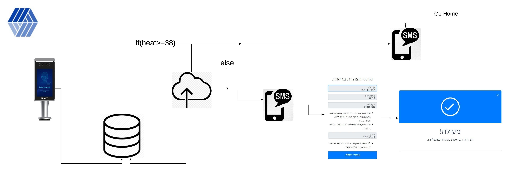
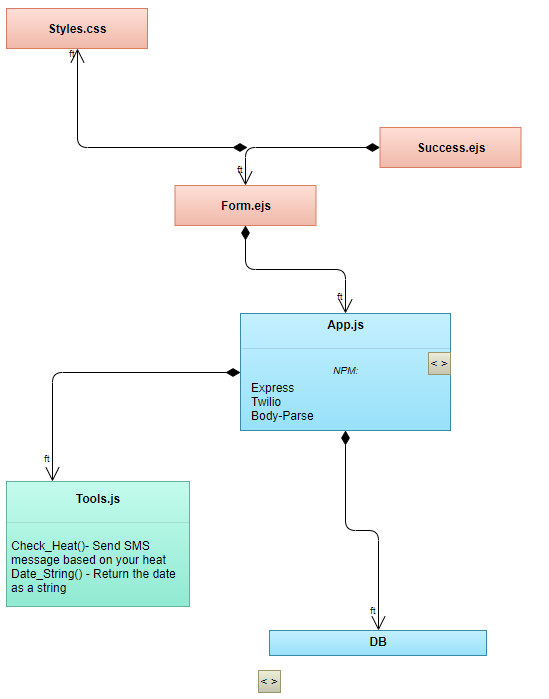

# <table><tr><td></td><td> <h1> SnippY</h1> 
</td></tr></table>

#             Who are we?

5 Students of Computer Science degree at Ariel University. Which we have developed a safe entry platform in the workplace following the Corona crisis. 

#    How does it work you probably ask?

- Your temperature are being analyzed by one of the machines we are using.
- According to your temperature you will recieve appropriate SMS message to your phone.
- If your temperature more that 38 an SMS message will sent to you, Asking of you to go home.
- If your temperature below 38 you will recieve an SMS asking of you to fill out medical form

#    Code - Diagram

#    Code - Explantaion
This code based build in Node.js based on Express NPM:
- App.js - Mannage all the Http requests and responses , Mannage SQL connections.
- Tools.js - Logical functions 
- Form.ejs - Medical form that only allows to access you receive the Url from Us
- Success.ejs - If you approve the form you are being redirected to that page, it will let you access your workplace.
